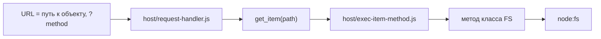
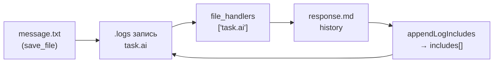

# WORK — Extensible Fractal File System

## Назначение платформы WORK (ODANT)

**WORK** — файло-ориентированная веб-платформа ([odant.org](https://odant.org)): **структура папок на диске одновременно является данными, API и точкой входа в UI**. Не нужно отдельно проектировать БД, REST-контроллеры и фронтенд-роутинг — они вырастают из дерева каталогов.

### Идея в одном абзаце

Проект — **фрактальная файловая система**. Каждая папка — это `$folder` или наследник (`$storage`, `$structure`, `$user` …). У каждого хранилища есть **метапапка** с именем на `$` (у корня — `$server`). В метапапке лежит **`data.js`**: описание типа, наследование, handlers. Движок в `sources/` интерпретирует это дерево; фреймворк **ODA** в `oda/` рисует интерфейс по handler-скриптам с диска. URL = путь к объекту, метод = query-параметр (`/root/direction/group?info`).

### Три части платформы

| Часть | Назначение |
|-------|------------|
| **`sources/`** | Ядро: HTTP-сервер, навигация `get_item`, классы FS, merge `data.js`, журнал `.logs`, auth |
| **`oda/`** | Визуальный фреймворк (Web Components, Reactor) — отображение и формы |
| **Диск (`$server/`, `root/`, `users/` …)** | Содержимое и **самоописание системы**: типы, формы, прикладные модули |

Корень репозитория — **корневое хранилище** с метапапкой **`$server`**: каталог системных типов и шаблонов, из которых собирается всё остальное.

### Что платформа даёт

1. **«Папка = объект»** — файлы, группы, пользователи, структуры: общие операции `info`, `save_file`, `create`, history, logs.
2. **Расширяемость без пересборки ядра** — новый тип, `$task` или `$handler` в `$server/…`, ядро не меняется.
3. **Наследование** — `~` и merge `data.js` слоями (`$storage` → `$structure` → группа).
4. **UI из `$handler`** — `~/handlers/pages/…/$handler/data.js`, исполняется **на клиенте** (ODA, `execute()`).
5. **Секреты модулей** — `#system/{module}.json` на **элементе**; универсальные `read_secret` / `save_secret` на `$storage` (только admin).
6. **`$task` и `$trigger`** — `$task`: задачи по расписанию (временные маски), `execute()` как у `$handler`; `$trigger`: реакция на событие. Прикладная lib в `$server/…`.
7. **Журнал и history** — `.logs`, методы `$storage`: `logs`, `log_index`, `read_log_bodies` (движок); чат, календарь — прикладное поверх.
8. **Интеграции** — OnlyOffice, WebRTC, AI (`services/`), почта — модули базы, не в `sources/`.

### Типы исполнения (важно)

| Тип | Где | Назначение |
|-----|-----|------------|
| **`$handler`** | Клиент | UI, форма, `execute()` в браузере |
| **`$task`** | Сервер | Задачи **по расписанию** (временные маски), `execute()` в контексте типа |
| **`$trigger`** | Сервер | Реакция на событие (сохранение файла, hook) |

Не путать: **`$handler` — не серверный API**. Папки `handlers/methods/…/$handler/` с `execute` на Node — **legacy**. Секреты модулей — методы `$storage`: `read_secret` / `save_secret` (admin). Прикладная lib — `$server/$folder/lib/…`.

### Граница ответственности

```
sources/    →  КАК работает дерево (механизм FS, HTTP, merge, logs)
$server/     →  ЧТО умеет система (типы, $task, $trigger, lib, UI-handlers)
oda/         →  КАК это выглядит (UI-фреймворк)
root/users/  →  экземпляры данных
```

Движок не знает про email, GigaChat или чат — только `$folder`, `$storage`, `get_item`, merge и **универсальные** методы storage (`info`, `save_file`, `logs`, `log_index`, `read_secret`, `save_secret`). Прикладное **поставляется базой**: lib + `$handler` для UI.

### Клиент и сервер — одни имена, разные реализации (важный нюанс)

Классы `$folder`, `$storage`, `$file`, `$user` существуют **дважды** — это сделано **намеренно**, один контракт с двух сторон:

| Класс | Сервер ([`sources/server/*.js`](sources/server/)) | Клиент ([`sources/client/*.js`](sources/client/)) |
|-------|---------------------------------------------------|---------------------------------------------------|
| `$storage` | реальная работа: `node:fs`, merge `data.js`, logs | прокси: `fetch('logs')`, `fetch('save')` |
| `$file` | `writeFile`, history, RAG | загрузка/скачивание по HTTP |

Один файл на класс с каждой стороны: `server/folder.js` ↔ `client/folder.js` и т.д. На сервере `$storage.logs()` читает `.logs` с диска; на клиенте — это HTTP-запрос. **Одно имя, разное поведение.** При отладке держите в голове: «я сейчас в серверном `server/` или в клиентском `client/`?».

Глобалы тоже парные: `WORK` / `CORE` на сервере (Node) и в браузере — разные объекты.

### Цикл запроса



`exec-item-method` разрешает метод так: сначала **метод класса FS** (`info`, `save_file`, `logs`, `read_secret`, …), затем (legacy) `~/handlers/methods/…`.

---

## Принципы кода

Стиль проекта — **минимализм связей**, а не «мало строк»:

- **Минимум файлов с однозначными связями** — по импортам сразу видно, кто кого вызывает.
- **Линейный граф движка:** `host/* → server/* → node:fs`; клиент `boot/ → client/`. Обе грани классов зависят только от `shared/` — **обратного ребра `server → client` нет**.
- **Жёсткая граница «движок / прикладное»** — в `sources/` только универсальные механизмы; email, chat, AI — в `$server/…`.
- **Без «магии»** — прямые импорты классов вместо реестров/`Object.assign`; никаких мутаций `JSON`/`Object.prototype` (сериализация — чистые функции в `shared/to-script.js`); побочные эффекты (STUN) — только в bootstrap.
- **Общее — в `shared/`** (path-syntax, сериализация), а не в клиентских классах.

> Документ живой: уточняем README по мере прояснения архитектуры.

---

## Быстрый старт

```bash
npm install
npm start
```

Открыть: http://localhost:8001/

## Переменные окружения

Скопируйте `.env.example` в `.env` и настройте при необходимости:

| Переменная | По умолчанию | Описание |
|------------|--------------|----------|
| `WORK_DEV` | `false` | Режим разработки (логи, без утечки секретов в HTTP) |
| `WORK_HOST` | `localhost` | HTTP-хост |
| `WORK_PORT` | `8001` | HTTP-порт |
| `WORK_TLS_CERT` | — | Путь к TLS-сертификату |
| `WORK_TLS_KEY` | — | Путь к TLS-ключу |

## Структура репозитория

```
work/
├── sources/               ← ядро (движок)
│   ├── server/            серверные классы FS ($item, $folder, $storage, $file, $user)
│   ├── client/            клиентские классы-прокси (те же имена)
│   ├── shared/            общее обеим граням (path-syntax, to-script, config, constants)
│   ├── host/              серверный рантайм (work.js, HTTP/WS/STUN, WorkServer, auth, merge)
│   └── boot/              браузерная обвязка (boot.js)
├── oda/                   ← UI-фреймворк
├── $server/               ← база: типы, lib, $handler / $task / $trigger
├── root/                  ← данные приложения
├── users/                 ← профили пользователей
└── services/              ← внешние сервисы (AI и т.д.)
```

**Фрактал на диске:** корень `./` = WorkServer (`$storage`), метапапка `$server/`; внутри групп — `$structure/`, файлы рядом.

**Пример базы (прикладной модуль):**

```
$server/$folder/lib/email/settings.js     ← прикладная логика (папки ящиков, SMTP lookup)
$server/.../form/email/$handler/data.js   ← UI: fetch('read_secret', {name:'email'})
```

Секрет модуля на элементе: `{meta}/#system/email.json`, доступ через `?read_secret&name=email` / `?save_secret&name=email`.

## API

URL = путь к объекту FS. Первый query-параметр без значения — имя метода:

```
/root/direction/group?info
/root/direction/group?read_secret&name=email
/root/direction/group?log_index&flat=1&ext=eml
```

**Разрешение на сервере** (`exec-item-method`):

1. Метод **класса FS** (`info`, `save_file`, `logs`, `log_index`, `read_secret`, `save_secret`, …)
2. ~~`~/handlers/methods/…`~~ — legacy; для нового кода не использовать

На клиенте `$handler` из `~/handlers/pages/…` вызывается через `$item.execute()` / ODA, не через серверный `$handler` в `methods/`.

---

## Справочник платформы

### Префиксы имён (по первому символу)

Имя папки/файла кодирует её роль — это основа фрактала:

| Префикс | Значение | Пример |
|---------|----------|--------|
| `$` | **тип** (метапапка / хранитель типа) | `$server`, `$structure`, `$group`, `$user`, `$file`, `$handler` |
| `#` | **системное / секрет** (не в выдачу по HTTP) | `#system/email.json`, `#security` |
| `.` | **скрытое / history-контейнер** | `.data.logs`, `.message.txt`, `.RAG` |
| прочее | **экземпляр данных** | `direction`, `group`, `report.docx` |

В коде: `isType` = имя на `$`, `isHidden` = имя на `.`, `isMetaFolder` = тип внутри `$storage`.

### Сущности и типы

| Тип | Класс | Что это |
|-----|-------|---------|
| `$folder` | `$folder` | базовая папка-объект (`info`, `save_file`, `create`, children) |
| `$storage` | `$storage` | папка с метапапкой и `data.js`: own-тип, merge, logs, secrets |
| `$structure` / `$group` | `$storage` | прикладные storage-типы (группа, раздел) |
| `$user` | `$user` | каталог пользователя (`users/…`), online-статус |
| `$file` | `$file` | файл: load/save, history, RAG |
| `$handler` | `$handler` | UI-метод экземпляра, `execute()` на клиенте |
| `$task` | — | задача по расписанию (временные маски) |
| `$trigger` | — | реакция на событие |
| `$server` | — | метапапка корня: системные типы и шаблоны |

`WorkServer` (корень репозитория) — это `$storage` с метапапкой `$server`. Список системных типов: `$server, $user, $handler, $trigger, $task`; прикладные типы сканируются из дерева `$folder`.

#### Прикладные типы-«затравки»

Классы-наследники `$storage` как прикладные прототипы: `$base`, `$group`, `$user`, `$service`, `$skill`, `$node`, `$paas`. Это **не часть ядра** — их доменная логика живёт в дереве, не в `sources/`.

- **`$skill`** — прикладной тип (наследник `$storage`). Прототип: `skills/$skill/$storage/$skill/data.js` с базовым `execute()`.
- **Доменная логика скилов** (роутер, исполнитель) живёт в `skills/$skill/$storage/$skill/lib/` и наследуется через `~`. **Не в `sources/`.**
- `sources/host/skill-router.js` и `skill-manager.js` — **временное** нарушение, подлежат переносу.

#### Реакции на `save_file` (file-handlers → триггеры)

**Текущее (временное):** `file-handlers.js` — статический словарь в ядре. Ядро знает прикладные имена файлов.

**Цель:** ядро при `save_file` ищет триггер через наследование: `$storage.get_item('~/triggers/' + filename)`. Ядро не знает имена файлов.

#### Прикладные типы-«затравки»

Классы-наследники $storage как прикладные прототипы: $base, $group, $user, $service, $skill, $node, $paas. Это **не часть ядра** — их доменная логика живёт в дереве, не в sources/.

- **$skill** — прикладной тип (наследник $storage). Прототип: skills////data.js с базовым execute().
- **Доменная логика скилов** (роутер, исполнитель) живёт в skills////lib/ и наследуется через ~. **Не в sources/.**
- sources/host/skill-router.js и skill-manager.js — **временное** нарушение, подлежат переносу.

#### Реакции на save_file (file-handlers → триггеры)

**Текущее (временное):** ile-handlers.js — статический словарь WORK.file_handlers в ядре. Ядро знает прикладные имена файлов.

**Цель:** ядро при save_file ищет триггер через наследование: $storage.get_item('~/triggers/' + filename). Ядро не знает имена файлов.

### Метапапка и `data.js`

Каждое хранилище содержит **метапапку** (первый каталог на `$`) с файлом **`data.js`** — `export default { … }`:

- описание типа (icon, label, поля `METADATA`)
- `#security` (admin, users)
- handlers, наследование

Движок собирает итоговый `data.js` через **merge по слоям наследования** (`mergeFiles` → `mergeScripts`, babel-merge). При сохранении (`$storage.save()`) пишется только **разница** с точкой наследования (`getDifference` + `toScript` из [`shared/to-script.js`](sources/shared/to-script.js)), а не весь объект. `to-script.js` — обратная сторона merge: объект → текст `data.js`.

### Синтаксис путей (`get_item`)

URL и `get_item(path)` понимают спецшаги (метод `get_item` в [`sources/server/folder.js`](sources/server/folder.js)):

| Шаг | Значение |
|-----|----------|
| `имя` | дочерний элемент по id |
| `~` | **tilde** — собранное по наследованию содержимое (handlers, lib, triggers) |
| `~$тип` | tilde до конкретной точки наследования |
| `@key` | свойство/предок объекта (`@ancestor`, `@users`, `@count`) |
| `*` / `*.js` | все потомки (с фильтром по окончанию) |
| `.` | текущий объект |
| `//uid` | поиск элемента по id вглубь (например пользователя) |

`toShortPath` скрывает `$мета`-сегменты, заменяя их на `~` для публичных URL.

### Наследование и merge

- **`~` / tilde** — `collect_tilde()` собирает файлы со всех слоёв типа (от `$folder` базового до собственной метапапки). Так `$handler`, `lib`, `triggers` наследуются от типа к экземпляру.
- **merge `data.js`** — слои `$storage → $structure → группа` сливаются в один объект.
- **`~` в URL** — точка входа к наследуемым ресурсам: `/path/~/handlers/pages/form/`.

### Журнал и history

- Запись файла версионируется в `history`:  
  `…/{source}/history/{day}/{timestamp}.{uid}.{ext}`
- `.logs` — журнал хранилища; методы `$storage`: `logs` (режимы `folder|bodies|index|files`), `log_index` (лёгкий срез), `read_log_bodies`.
- После `save_file` движок вызывает `WORK.file_handlers[filename]` (см. [`file-handlers.js`](sources/host/file-handlers.js)) — точка расширения (chat `message.txt`, `outbox.eml`, `phone.call`).
- **AI-диалог в чате** — пайплайн `message.txt` → `task.ai` → GigaChat → `response.md`; подробности в разделе [AI-задачи и микрочат](#ai-задачи-и-микрочат-taskai) ниже.

### AI-задачи и микрочат (task.ai)

Прикладной сценарий: пользователь пишет в чат → создаётся задача AI → ответ ассистента показывается **внутри карточки task.ai** (микрочат), не отдельным `{guid}.task`.

#### Пайплайн



1. **`message.txt`** без `receivers` → [`file-handlers.js`](sources/host/file-handlers.js) создаёт **`task.ai`** с `includes: [путь message.txt history]`.
2. Handler **`task.ai`** (асинхронно, после `save_to_log`) → GigaChat → **`response.md`** в history → **`appendLogIncludes`** дописывает путь ответа в ту же запись `.logs`.
3. Продолжение диалога в микрочате → метод **`task_reply`** на `$storage`: новый `message.txt`, `appendLogIncludes`, снова `task.ai`, возврат актуальной строки лога.

Тесты: [`tests/task-pipeline.test.js`](tests/task-pipeline.test.js).

#### Модель данных

| Поле / файл | Смысл |
|-------------|--------|
| **`task.ai`** | Фиксированное имя типа; экземпляры только через **history** (`…/ai/.task.ai/history/…`) |
| Запись **`.logs`** | `content` — текст задачи; **`path`** — history-файл task.ai; **`includes[]`** — полные пути шагов (`message.txt`, `response.md`, `error.txt`) |
| **`includes`** | Микрочат = содержимое этих файлов, **не** отдельный JSON-диалог и не `{guid}.task` |
| Зеркало логов | `save_to_log` может писать в кабинет автора (`logAuthor`); dedupe по storage id |

Пути в `includes` — **полные** (`/users/…/text/.message.txt/history/…`), не short `~`.

#### UI: три слоя (границы ответственности)

| Компонент | Файл | Роль |
|-----------|------|------|
| **`chat-day`** | [`chat/…/data.js`]($server/$folder/$storage/handlers/pages/form/chat/$handler/data.js) | День ленты; **`logItems`** + **`get logs()`**; инкрементальное добавление `.logs` по WS `changed` |
| **`chat-item`** | там же | Карточка; `$item` = файл **`.logs`**; **`logData`** → `:log="previewLog"` в preview |
| **`ai-preview`** | [`$ai/…/preview/data.js`]($server/$folder/$file/$ai/handlers/preview/$handler/data.js) | Generic UI: thread из **`log.includes`**, prompt, **`task_reply`**; **не знает** про GigaChat |

**Правило:** доработки AI (ожидание ответа, опрос, нормализация лога) — **только в `ai-preview` и сервере**. **Не ломать** инкремент чата (`chat-day` / `chat-item`): не сбрасывать `body` у `.logs`, не перезагружать всю ленту ради микрочата.

#### Серверные методы (`$storage`)

| Метод | Назначение |
|-------|------------|
| **`appendLogIncludes(entryPath, paths)`** | Дописать пути в `includes` записи лога по `path` history task.ai |
| **`read_log_entry({ taskPath })`** | Актуальная JSON-строка лога с диска (для опроса микрочата) |
| **`task_reply(params, post)`** | Новое сообщение в существующей task: message → includes → `task.ai` → обновлённая запись (+ `replyText` в ответе) |

`task.ai` handler возвращает `{ responsePath, responseText }` (или `errorText`); `task_reply` мержит это в ответ клиенту.

#### Клиент: подводные камни

1. **`WORK.__bind`** — ответ с полем **`path`** превращается в клиентский **`$file`**. Поля вроде **`includes`** оказываются в **`DATA`**, а обращение к **`item.includes`** у `$folder` может уйти в **`_onEmpty`** и вернуть не массив. В **ai-preview** лог нормализуют в plain-объект: `row.DATA ?? row`, массив `includes` явно.
2. **Кэш `get_item` / `file.body`** — только что созданный `response.md` может не подтянуться до F5. В микрочате: **`WORK.fetch(path, 'load')`** для includes; опрос **`read_log_entry`** через **прямой `fetch`** (без `__bind`); при pending — подписка на **`changed`** storage.
3. **Устаревший `log` от родителя** — `chat-item` при `changed` на `.logs` может отдать кэшированное тело **без** нового `includes`; ai-preview **не принимает** откат (сравнение signature/rank `includes`) и сам догружает ответ.

#### ODA: `logs` в `chat-day`

**Важно:** ODA-шаблон читает свойства через **`$pdp`**, а не Reactor-proxy с `_onEmpty`. Для `chat-day` используется **`logItems: []` + `get logs()`** + однократный `_ensureLogsInit()` (флаг, не Promise-кэш):

- первый доступ к **`logs`** в `~for` → `_ensureLogsInit()` → загрузка в **`logItems`**;
- инкремент — **`push`** в `logItems` + `render()`;
- подписка `listen('changed')` — один раз на экземпляр (`_logsListenersHooked`).

`_onEmpty` — паттерн **клиентских** `$item` / `$folder` (Reactor.activate), не ODA custom elements в шаблоне чата.

#### Ключевые файлы

```
sources/host/file-handlers.js          message.txt, task.ai handlers
sources/server/storage.js              appendLogIncludes, task_reply, read_log_entry, _findLogEntry
sources/server/file.js                 save_to_log, log.path / includes
$server/.../chat/$handler/data.js      chat-day, chat-item (лента)
$server/.../ai/.../preview/data.js     ai-preview (микрочат)
tests/task-pipeline.test.js            регрессия пайплайна
```

### Свойства объекта FS (частые геттеры)

| Геттер | Значение |
|--------|----------|
| `path` / `short` | полный путь / публичный (без `$мета`) |
| `dir` / `real_dir` | путь на диске / реальный источник (с учётом наследования) |
| `id` / `type` / `label` | id, тип (id метапапки), отображаемое имя |
| `$parent` | ближайший типизированный родитель (`$storage`) |
| `$owner` | типизированный владелец метапапки |
| `$storage` | ближайший `$storage` вверх по дереву |
| `$context` | объект-носитель для handler/task (вне метапапок) |
| `children` / `files` | потомки / потомки без скрытых |

### Глобальные объекты

| Глобал | Сервер (Node) | Клиент (браузер) |
|--------|---------------|-------------------|
| `WORK` | `WorkServer` (корневой `$storage`) | корневой прокси через `fetch` |
| `CORE` | классы из [`server/index.js`](sources/server/index.js) | классы из [`client/index.js`](sources/client/index.js) |
| `$server` | helpers/merge на сервере | — |

### Карта файлов движка

```
sources/
  work.js              entrypoint сервера WORK
  client.js            entrypoint клиента (браузер)
  server/              СЕРВЕР: грани классов FS на диске (Node)
    index.js           сборка CORE: FS + экспорт классов
    item.js            $item: база (DATA, путь, isType/isHidden, genGUID)
    folder.js          $folder: дерево, children, tilde, info, save_file, get_item
    storage.js         $storage: data.js, merge, logs, read/save_secret
    file.js            $file: load/save, history, RAG
    user.js            $user
    helpers.js         временные остатки: inherit, rag-утилиты, importScript
  client/              КЛИЕНТ: грани классов-прокси (браузер)
    index.js           сборка CORE для браузера
    item/folder/storage/file/user/field/handler.js   прокси через fetch
  shared/              временно: остатки до переноса в классы
    to-script.js       объект → data.js (toScript/getDifference) — обратное к merge
    path-syntax.js     history-подписи
  host/                СЕРВЕРНЫЙ РАНТАЙМ (сервер(ы) + сервисы)
    config.js          env → константы
    work-server.js     WorkServer extends $storage; merge; types; push
    http-server.js     запуск HTTP/HTTPS
    request-handler.js разбор запроса, POST-тело, заголовки
    exec-item-method.js разрешение метода (класс FS → legacy handler)
    file-handlers.js   реакции на save_file (chat, email, call)
    auth-methods.js    логин/сессии
    email-utils.js     parse/send EML (nodemailer)
    stun.js, websocket.js, push.js, mail.js, vapid.js, babel-merge.js …
  boot/
    boot.js            браузерная обвязка: ODA + client/ + виджеты (не сервер)
  page.html, manifest.json, odant.png   публичная статика (пути стабильны)
```

> `sources/modules/` (embeddings для RAG, виджеты call/contacts/user-profile, вендор OnlyOffice) — прикладное/вендор; вынос в `boot/`/`services/` запланирован отдельной задачей.

---

## Тесты

```bash
npm test
```

## Публикация (SVN → Git)

SVN — основной репозиторий, GitHub — автоматическое зеркало.

```powershell
# Первичная настройка (после svn checkout)
npm run setup-mirror

# Опубликовать: svn commit + git push
npm run publish -- -Message "Описание изменений"

# Подтянуть изменения команды и обновить зеркало
npm run sync
```

В Cursor: **Terminal → Run Task → Publish: SVN → Git**
